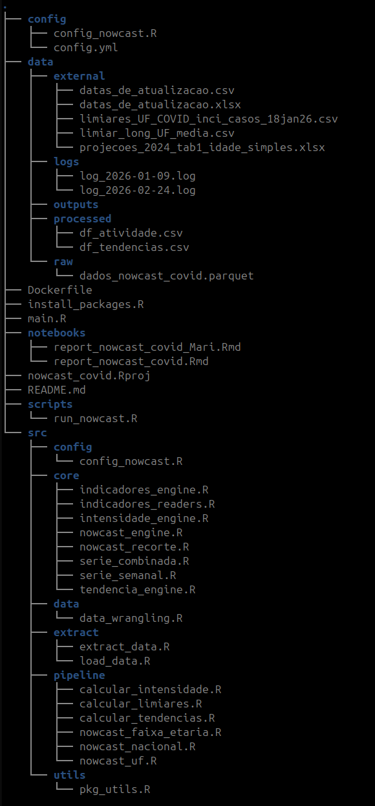

# Estimativas Nowcast - Síndrome gripal pela covid-19
---

1. Objetivo:
Estimar o atraso nos registros de notificação de síndrome gripal pela covid-19.

2. Usuários:
Área técnica e equipe de vigilância epidemiológica de covid-19.

3. Dados:
Os dados utilizados são do sistema de informação e-SUS Notifica do Ministério da Saúde.

4. Organização do projeto

5. 