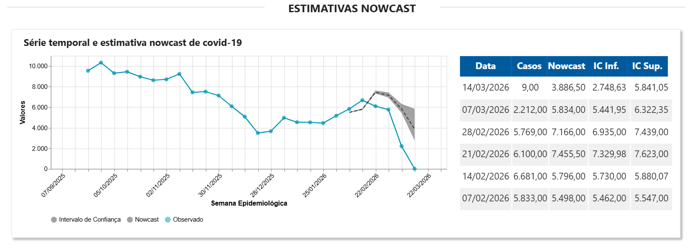
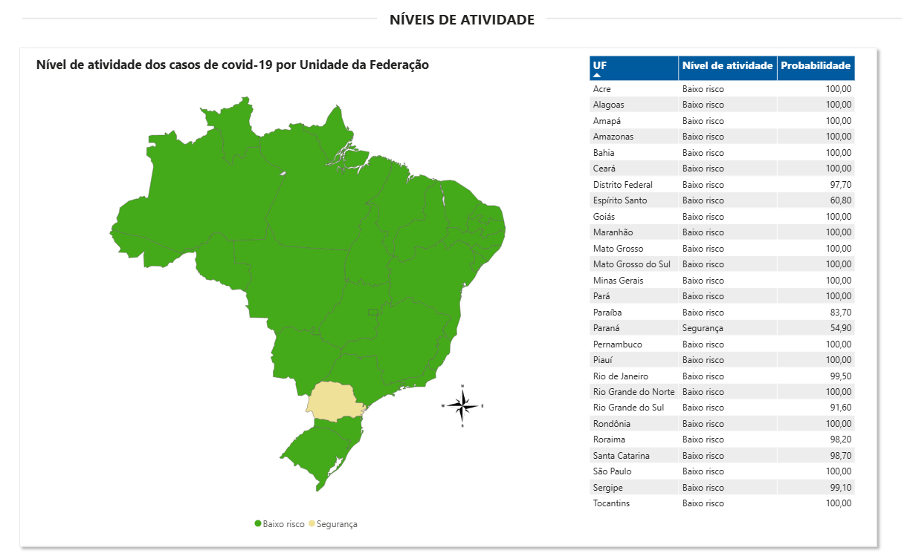
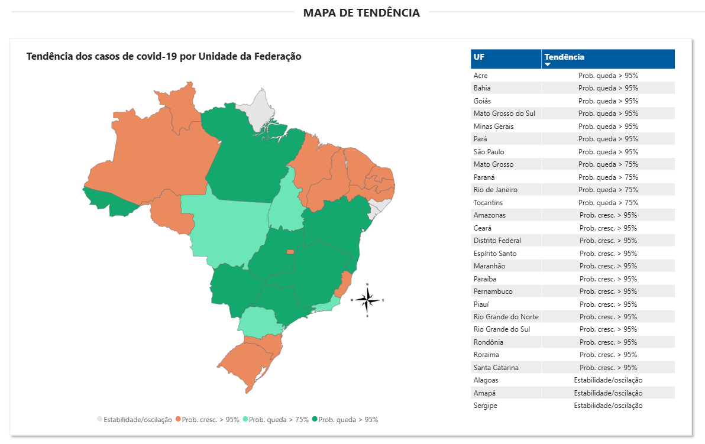

# Estimativas Nowcast - Síndrome gripal pela covid-19
---







1. Objetivo:
Estimar o atraso nos registros de notificação de síndrome gripal pela covid-19.

2. Usuários:
Área técnica e equipe de vigilância epidemiológica de covid-19.

3. Dados:
Os dados utilizados são do sistema de informação e-SUS Notifica do Ministério da Saúde.

4. Organização do projeto

```
.
├── config
│   └── config.yml
├── data
│   ├── external
│   │   ├── datas_de_atualizacao.csv
│   │   ├── datas_de_atualizacao.xlsx
│   │   ├── limiares_UF_COVID_inci_casos_18jan26.csv
│   │   ├── limiar_long_UF_media.csv
│   │   └── projecoes_2024_tab1_idade_simples.xlsx
│   ├── logs
│   │   ├── log_2026-01-09.log
│   │   ├── log_2026-02-24.log
│   │   ├── run_20260317_144600.log
│   │   ├── run_20260317_161843.log
│   │   ├── run_20260317_164411.log
│   │   ├── run_20260318_112302.log
│   │   └── run_20260318_112437.log
│   ├── outputs
│   ├── processed
│   │   ├── df_faixa_etaria.csv
│   │   ├── df_intensidade.csv
│   │   ├── df_nowcast.csv
│   │   └── df_tendencias.csv
│   └── raw
│       └── dados_nowcast_covid.parquet
├── Dockerfile
├── docs
│   └── img
│       └── tree.png
├── install_packages.R
├── notebooks
│   ├── report_nowcast_covid_Mari.Rmd
│   └── report_nowcast_covid.Rmd
├── nowcast_covid.Rproj
├── README.md
├── scripts
│   ├── run_nowcast.R
│   └── setup.R
├── src
│   ├── config
│   │   └── config_nowcast.R
│   ├── core
│   │   ├── indicadores_engine.R
│   │   ├── indicadores_readers.R
│   │   ├── intensidade_engine.R
│   │   ├── nowcast_engine.R
│   │   ├── nowcast_recorte.R
│   │   ├── serie_combinada.R
│   │   ├── serie_semanal.R
│   │   └── tendencia_engine.R
│   ├── data
│   │   ├── data_wrangling.R
│   │   └── validate_data.R
│   ├── extract
│   │   ├── extract_data.R
│   │   └── load_data.R
│   ├── pipeline
│   │   ├── calcular_intensidade.R
│   │   ├── calcular_limiares.R
│   │   ├── calcular_tendencias.R
│   │   ├── consolidar_series.R
│   │   ├── nowcast_faixa_etaria.R
│   │   ├── nowcast_nacional.R
│   │   ├── nowcast_uf.R
│   │   └── salvar_outputs.R
│   └── utils
│       ├── log_utils.R
│       └── pkg_utils.R
└── tests
    ├── testthat
    │   ├── test_config.R
    │   ├── test_consolidar_series.R
    │   ├── test_data_wrangling.R
    │   ├── test_indicadores.R
    │   ├── test_nowcast_engine.R
    │   ├── test_pkg_utils.R
    │   └── test_tendencia_intensidade.R
    └── testthat.R
```

5. Preparação para a build do projeto

a) Estrutura de credenciais - antes de buildar
O extract_data.R e o load_data.R precisam se autenticar no Sharepoint.

```r
# src/extract/extract_data.R — ler credenciais do ambiente
tenant_id <- Sys.getenv('SHAREPOINT_TENANT_ID')
client_id <- Sys.getenv('SHAREPOINT_CLIENT_ID')
client_secret <- Sys.getenv('SHAREPOINT_CLIENT_SECRET')
site_url <- Sys.getenv('SHAREPOINT_SITE_URL')
```

b) Arquivo .env - No servidor, nunca no repositório

```bash
# .env  ← adicionar no .gitignore
SHAREPOINT_TENANT_ID=xxxxxxxx-xxxx-xxxx-xxxx-xxxxxxxxxxxx
SHAREPOINT_CLIENT_ID=xxxxxxxx-xxxx-xxxx-xxxx-xxxxxxxxxxxx
SHAREPOINT_CLIENT_SECRET=sua_secret_aqui
SHAREPOINT_SITE_URL=https://suaorg.sharepoint.com/sites/seusite
```

6. Comandos no servidor Ubuntu

a) Instalar Docker

```bash
curl -fsSL https://get.docker.com | sudo sh
sudo usermod -aG docker $USER
newgrp docker
```

b) Clonar projeto e configurar credenciais

```bash
git clone https://seu-repositorio/nowcast_covid.git
cd nowcast_covid

# Criar o .env com as credenciais
nano .env
```

c) Build da imagem docker

```bash
docker build -t nowcast-covid .
```

d) Rodar container

```bash
docker run --rm \
  --env-file .env \
  -v $(pwd)/data:/app/data \
  nowcast-covid
```
-v $(pwd)/data:/app/data monta a pasta data/ do servidor dentro do container — os outputs em data/processed/ ficam disponíveis no servidor após a execução.


7. Rodar automaticamente no cron

```
# Editar o crontab
crontab -e

# Rodar toda segunda-feira às 6h
0 6 * * 1 cd /home/usuario/nowcast_covid && docker run --rm \
  --env-file .env \
  -v $(pwd)/data:/app/data \
  nowcast-covid >> data/logs/cron.log 2>&1
```

---

## Fluxo completo no servidor
```bash
cron / execução manual
        │
        ▼
docker run nowcast-covid
        │
        ├── extract_data.R  →  baixa parquet do SharePoint  →  data/raw/
        ├── run_nowcast.R   →  processa tudo                →  data/processed/
        └── load_data.R     →  envia CSVs para SharePoint
                │
                └── data/logs/run_YYYYMMDD_HHMMSS.log  (persistido via volume)
```

---

## `.gitignore` — garantir que credenciais não vazem
```
.env
data/raw/
data/processed/
data/logs/
```
